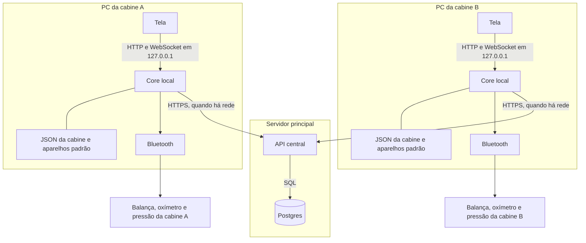

# 02 — Arquitetura

Como o produto funciona com várias cabines ao mesmo tempo: cada uma mede nos próprios aparelhos, e o histórico de quem se identifica fica num banco só.

## 1. Comunicação

A tela de cada cabine fala apenas com o core daquele PC. O Bluetooth fica nesse core. O Postgres fica no servidor, e só a API central abre SQL. Com rede, o core da cabine chama a API para login, sessão, leitura e pareamento. Sem rede, o modo anônimo usa o JSON local e o rádio, e não chama o servidor.



| Caminho | Quando | O que passa |
|---|---|---|
| Tela → core local | Sempre | HTTP e WebSocket em `127.0.0.1`. A tela não fala com o banco nem com o Bluetooth |
| Core local → aparelhos | Na coleta e no pareamento | Bluetooth daquele PC. A conexão dura a medição |
| Core local → JSON | Coleta sem rede, e depois de cada pareamento | `machine_id`, `cabin_id` e dados do aparelho padrão de cada tipo |
| Core local → API central | Quando há rede | Login, sessão, leitura, questionário e pareamento |
| API central → Postgres | Sempre que a API grava ou consulta | SQL. A senha do banco fica só no servidor |

Uma cabine não chama a outra. O mesmo programa roda no servidor e em cada PC. No servidor ele é a API e aplica as migrations. Na cabine ele atende a tela, o rádio e o arquivo local.

> **Estado atual vs. alvo.** Hoje, em desenvolvimento, API, Postgres, core e front rodam na mesma máquina (`make dev`). A separação servidor/PC-da-cabine é a **direção** da modelagem multi-cabine; não há deploy em produção nem piloto (ver `11-estado-e-pendencias.md`).

### 1.1 O que cada máquina guarda

**Servidor.** API, Postgres e o manifesto de atualização. Não usa Bluetooth.

**PC da cabine.** Tela, core local, rádio, e um JSON fora da pasta do programa (`%ProgramData%\Cabine\cabin.json`, ou `CABIN_STATE_PATH`). O arquivo guarda `machine_id` (o `MachineGuid` do Windows) e `cabin_id`. Cerca de 1 KB. Não há cópia de usuários. O `cabin_id` não vai no `.env`. O MAC do aparelho é único: a API descobre a cabine pela linha do aparelho.

### 1.2 Várias cabines ao mesmo tempo

Cada PC tem o próprio processo e o próprio rádio, então várias pessoas medem juntas. Dentro de uma cabine, balança, oxímetro e pressão usam o rádio um de cada vez. Entre cabines não há esse bloqueio.

A API recebe login e gravação de todas. Cada leitura nova tem UUID. A sessão leva `cabin_id` daquele PC, e o aparelho da leitura pertence à mesma cabine.

## 2. Stack

| Camada | Tecnologia |
|---|---|
| Core | Python ≥ 3.12, uv, FastAPI, Uvicorn, SQLAlchemy 2 async, asyncpg, Alembic, Pydantic 2 / pydantic-settings, bcrypt, python-jose (JWT HS256), Bleak (BLE, Windows/WinRT) |
| Banco | PostgreSQL 16 (`postgres:16-alpine` via `cabine-core/docker-compose.yml`) |
| Web | TypeScript ~6, React 19, Vite 8 (+ `@vitejs/plugin-basic-ssl`), React Router 7, Axios, lucide-react |
| Qualidade web | ESLint 10 (flat config) + `tsc -b` |
| Qualidade core | Sem linter configurado ainda; `ruff` avulso. Sem testes ainda (ver `10-ambiente-e-operacao.md`) |
| Tempo real | WebSocket nativo (`/ws/*`) entre front e core |

Versões exatas: `cabine-core/pyproject.toml` + `uv.lock` e `cabine-web/package.json` + lock. Não duplicar versões em outras docs.

### Por que WebSocket e Bleak

- **WebSocket** (e não SSE/polling/gRPC/MQTT): o peso e as leituras chegam de forma assíncrona e contínua; encaixa no totem (1 cliente ↔ 1 stream). Fechar o WS encerra o adapter BLE.
- **Bleak**: async nativo (casa com FastAPI), suporta Windows 10/11 (WinRT), scan + GATT. Quirks do WinRT já mitigados (`services/ble/winrt_patch.py`, `ble_radio_lock`). Alternativas e quando considerá-las: `anexos/relatorio-protocolos-balancas.md` §5.4.

## 3. Monorepo

```
cabine/
  cabine-core/      # API + BLE (Python, uv)
  cabine-web/       # SPA (Vite)
  scripts/dev.ps1   # make dev
  Makefile          # make dev
  .cursor/          # specs + rules
  README.md
```

Estrutura interna de cada pacote: `08-backend.md` e `09-frontend.md`.

## 4. Princípios arquiteturais

1. Fluxo no core: `rota → schema → crud e/ou services`. Rota não monta `select()`; CRUD não importa FastAPI; rota não fala com Bleak.
2. Fluxo no web: `página → api.ts / session / modules → componente de UI`. Sem store global.
3. Um rádio BLE por PC: tudo passa por `ble_radio_lock`.
4. Contrato único: o front espelha a API em `src/types/` (snake_case).
5. Uma fonte de verdade por assunto (questionário de saúde só em `modules/health/questionnaires.ts`; composição corporal só no core; chaves de storage só em `session/keys.ts`).
6. Segredos e hardware de laboratório nunca no repositório (`.env`, MAC).
7. Mudança de schema sempre via migration Alembic.
8. Mudança de comportamento atualiza a spec no mesmo PR.
