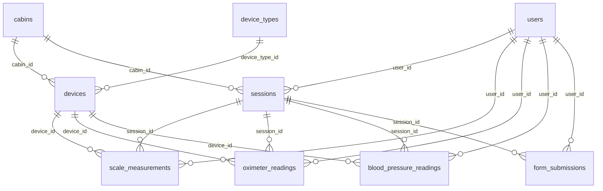

# 04 — Modelagem de dados

Postgres 16. Engine `postgresql+asyncpg`. Tabelas e colunas em inglês, plural `snake_case`. Todo model herda `Base` (`id` UUID + `created_at` / `updated_at`); **não** declarar `index=True` em `id` (a PK já é indexada) nem timestamps manuais.

Mapa arquivo ↔ tabela:

| Arquivo (`app/models/`) | Tabela | Classe |
|---|---|---|
| `user.py` | `users` | `User` |
| `admin.py` | `admins` | `Admin` |
| `cabin.py` | `cabins` | `Cabin` |
| `device_type.py` | `device_types` | `DeviceType` |
| `device.py` | `devices` | `Device` |
| `session.py` | `sessions` | `Session` |
| `measurement.py` | `scale_measurements` | `ScaleMeasurement` |
| `oximeter_reading.py` | `oximeter_readings` | `OximeterReading` |
| `blood_pressure_reading.py` | `blood_pressure_readings` | `BloodPressureReading` |
| `form_submission.py` | `form_submissions` | `FormSubmission` |

## 1. `cabins`

O PC físico.

| Coluna | Regra |
|---|---|
| `id` | UUID, chave |
| `description` | Texto da cabine |
| `machine_id` | `MachineGuid` do Windows; único, anulável (migration `g7b8c9d0e1f2`) |
| `is_active` | Cabine em uso |
| `modules` | Cardápio: `questionario`, `bioimpedancia`, `oximetria`, `pressao`, `temperatura` |
| `created_at` / `updated_at` | Auditoria |

## 2. `device_types`

Tipo clínico. O protocolo não fica aqui.

| `slug` | Aparelho |
|---|---|
| `scale` | Balança de bioimpedância |
| `oximeter` | Oxímetro |
| `blood_pressure_ecg` | Pressão de braço (HEM-7530T) |
| `blood_pressure_wrist` | Pressão de pulso (HEM-6161T2) |

`slug` único; `description` é o rótulo. Braço e pulso são tipos diferentes; a mesma cabine pode ter um padrão de cada.

## 3. `devices`

Um aparelho Bluetooth de uma cabine.

| Coluna | Regra |
|---|---|
| `cabin_id` | Cabine. Nulo só em estoque. Estoque não pode ser padrão |
| `device_type_id` | Tipo |
| `description` | Rótulo visto no pareamento |
| `address` | MAC, único no banco |
| `adapter` | Protocolo daquele aparelho |
| `parser` | Interpretação dos bytes daquele aparelho |
| `is_active` | Nasce `true` no pareamento |
| `is_default` | O que a coleta usa |
| `paired_at` | Quando pareou |

Integridade: índice único parcial em (`cabin_id`, `device_type_id`) onde `is_default`; CHECK `NOT is_default OR (is_active AND cabin_id IS NOT NULL)`.

## 4. `users`

Quem usa o totem.

| Coluna | Regra |
|---|---|
| `name` | Nome |
| `registration` | Matrícula, única |
| `birth_date` | Data de nascimento |
| `age` | Idade |
| `height_cm` | Altura em centímetros |
| `sex` | `male` ou `female` |
| `people_type` | `normal` ou `athlete` |
| `expected_weight_kg` | Peso esperado, opcional |

Não existem (não inventar): CPF, e-mail, telefone, foto, vínculo com empresa.

## 5. `admins`

Quem entra no painel. Sem cabine: um admin configura qualquer cabine.

`email` (único), `hashed_password` (bcrypt), `is_active`. O primeiro admin vem do seed (`e5f6a7b8c9d0_seed_admin_user.py`) ou de `POST /admins` quando ainda não existe nenhum.

## 6. `sessions`

Só o exame identificado. O anônimo não insere linha. No máximo uma sessão `open` por usuário.

`user_id` e `cabin_id` obrigatórios; `status` ∈ `open | completed | abandoned`; `started_at`; `completed_at` (vazio enquanto `open`).

## 7. `scale_measurements`

Pesagem e BIA. Altura, idade, sexo e tipo ficam na linha: o cálculo vale para o corpo daquele dia. `scale_name`, `adapter` e `device_address` são a cópia do aparelho na hora. O aparelho é da mesma cabine da sessão.

`user_id`, `session_id` obrigatórios; `device_id`; `weight_kg`; `height_cm`; `age`; `birth_date`; `sex`; `people_type`; `expected_weight_kg`; `stable`; `complete`; `impedances_ohm`, `segments`, `metrics` (JSONB; `metrics` = IMC, gordura, água, músculo; calculado no core).

## 8. `oximeter_readings`

`user_id`, `session_id` obrigatórios; `device_id`; `device_name` e `device_address` (cópia na hora); `spo2_pct`; `pulse_bpm`; `pi_pct` (opcional); `stable`; `waveform` (JSONB).

## 9. `blood_pressure_readings`

`user_id`, `session_id` obrigatórios; `device_id`; `device_name`, `device_address`; `sys_mmhg`; `dia_mmhg`; `pulse_bpm`; `movement`; `irregular_heartbeat`; `measured_at` (indexado). O tipo (braço/pulso) sai do aparelho.

## 10. `form_submissions`

Questionário. Sem aparelho. `user_id`, `session_id` obrigatórios; `module` ∈ `health | mental`; `status` (padrão `completed`); `payload` (JSONB com respostas, score, label…). Não há versionamento de questionário no banco: perguntas vivem no front; o `payload` guarda o que foi respondido.

## 11. Regras de dado

- No máximo um aparelho padrão por cabine e por tipo. Zero é válido.
- A coleta usa somente o aparelho com `is_default` **e** `is_active`.
- Balança, oxímetro, pressão de braço e de pulso seguem o mesmo cadastro.
- Apagar `users` ou `sessions` que já tenham leitura ou questionário é **recusado** na API e na FK. Exclusão de histórico, se necessária, é rotina à parte.
- Várias cabines compartilham usuários, sessões e leituras; cada uma tem os próprios aparelhos.
- Postgres só atrás da API central.
- Leitura nova tem UUID. Cópia (`device_name`, `device_address`, `scale_name`, `adapter`) preserva o histórico quando o aparelho muda.
- Sem PK inteira autoincrement.

## 12. Migrations (Alembic)

Ordem atual em `cabine-core/alembic/versions/`:

| Revision | Conteúdo |
|---|---|
| `a1b2c3d4e5f6_initial_schema` | Schema inicial |
| `b2c3d4e5f6a7_seed_rm_rd2504a` | Seed da balança RM-RD2504A |
| `c3d4e5f6a7b8_index_cleanup` | Remove índices redundantes em PK; indexa `blood_pressure_readings.measured_at` |
| `d4e5f6a7b8c9_paired_devices` | Aparelhos pareados |
| `e5f6a7b8c9d0_seed_admin_user` | Seed do admin |
| `f6a7b8c9d0e1_multi_cabin_model` | Modelo multi-cabine (`users`, `admins`, `cabins`, `devices`, `sessions`) |
| `g7b8c9d0e1f2_cabin_machine_id` | `cabins.machine_id` |

Regras:

1. Toda mudança de schema vira revision. Não alterar só o model.
2. Todo model novo é exportado em `app/models/__init__.py` (o `alembic/env.py` importa `Base` de lá).
3. Uma revision por mudança coesa, com nome em `snake_case` descritivo; conferir o `autogenerate` à mão (índices, CHECKs, JSONB).
4. Nunca editar revision já aplicada em ambiente compartilhado: criar uma nova.
5. Migration com dados (seed) é idempotente.
6. Revision é reversível quando possível (`downgrade` implementado); registrar no PR quando não for.
7. Comandos em `10-ambiente-e-operacao.md`.
