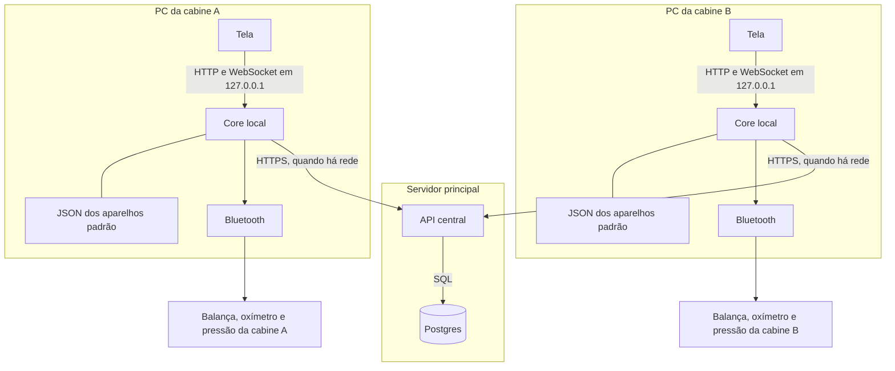
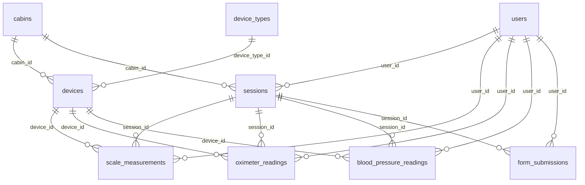

# Arquitetura — várias cabines

Como o produto funciona com várias cabines ao mesmo tempo: cada uma mede nos próprios aparelhos, e o histórico de quem se identifica fica num banco só.

## 1. Comunicação

A tela de cada cabine fala apenas com o core daquele PC. O Bluetooth fica nesse core. O Postgres fica no servidor, e só a API central abre SQL. Com rede, o core da cabine chama a API para login, sessão, leitura e pareamento. Sem rede, o modo anônimo usa o JSON local e o rádio, e não chama o servidor.




| Caminho                  | Quando                                       | O que passa                                                                      |
| ------------------------ | -------------------------------------------- | -------------------------------------------------------------------------------- |
| Tela → core local        | Sempre                                       | HTTP e WebSocket em `127.0.0.1`. A tela não fala com o banco nem com o Bluetooth |
| Core local → aparelhos   | Na coleta e no pareamento                    | Bluetooth daquele PC. A conexão dura a medição                                   |
| Core local → JSON        | Coleta sem rede, e depois de cada pareamento | MAC, adapter, parser e description do aparelho padrão de cada tipo               |
| Core local → API central | Quando há rede                               | Login, sessão, leitura, questionário e pareamento                                |
| API central → Postgres   | Sempre que a API grava ou consulta           | SQL. A senha do banco fica só no servidor                                        |


Uma cabine não chama a outra. O mesmo programa roda no servidor e em cada PC. No servidor ele é a API e aplica as migrations. Na cabine ele atende a tela, o rádio e o arquivo local.

### 1.1 O que cada máquina guarda

**Servidor.** API, Postgres e o manifesto de atualização. Não usa Bluetooth.

**PC da cabine.** Tela, core local, rádio, e um JSON fora da pasta do programa. O arquivo lista o aparelho padrão de cada tipo (MAC, adapter, parser, description) e o `id` da cabine, gravado quando o admin a escolhe na tela de equipamentos. Cerca de 1 KB. Não há cópia de usuários. O `id` não vai no `.env`. O MAC é único: a API descobre a cabine pela linha do aparelho.

### 1.2 Várias cabines ao mesmo tempo

Cada PC tem o próprio processo e o próprio rádio, então várias pessoas medem juntas. Dentro de uma cabine, balança, oxímetro e pressão usam o rádio um de cada vez. Entre cabines não há esse bloqueio.

A API recebe login e gravação de todas. Cada leitura nova tem UUID. A sessão leva `cabin_id` daquele PC, e o aparelho da leitura pertence à mesma cabine.

## 2. Software

Monorepo. A tela é `cabine-web`. A API e o Bluetooth são `cabine-core`.


| Pasta          | Papel                                                    |
| -------------- | -------------------------------------------------------- |
| `cabine-core/` | API, acesso ao Postgres no servidor, Bluetooth na cabine |
| `cabine-web/`  | Totem e painel do admin, o mesmo aplicativo              |
| `docs/`        | Esta arquitetura e as notas de hardware                  |


**Core.** Python 3.12+, uv, FastAPI, Uvicorn, SQLAlchemy assíncrono, asyncpg, Alembic, Pydantic, Bleak no Windows.

```
cabine-core/app/
  main.py              # FastAPI e CORS
  api/router.py        # junta as rotas
  api/routes/          # HTTP e WebSocket
  schemas/             # contrato
  crud/                # persistência, só no servidor
  models/              # tabelas
  core/                # config, banco, JWT, limite de login
  services/            # regra e hardware
    ble/               # rádio da cabine
    scale/             # balança RM-RD2504A
    oximeter/          # oxímetro
    blood_pressure/    # pressão de braço e de pulso
    devices/           # pareamento
```

**Web.** TypeScript, React, Vite, React Router, Axios. O estado da sessão fica em memória e em `sessionStorage`. O token fica em `localStorage`.

```
cabine-web/src/
  App.tsx              # rotas
  api.ts               # cliente HTTP e WebSocket do core local
  pages/kiosk/         # totem
  pages/admin/         # painel
  kiosk/               # layout e sessão
  session/             # token e sessão
  modules/health/      # questionário
  modules/mental/      # saúde mental
```

O cardápio de cada cabine vem de `cabins.modules`: `questionario`, `bioimpedancia`, `oximetria`, `pressao`, `temperatura`.

Identificadores de tabela em inglês. JSON da API em snake_case. Texto de erro e de tela em português.

### 2.1 Autenticação

JWT HS256, assinado com `SECRET_KEY`. O servidor não guarda sessão. Qualquer processo com a mesma chave confere o token. Na prática, quem emite e quem valida o exame identificado é a API central. O core da cabine só encaminha.


| Quem             | Entrada                        | Claims                                         | Validade   |
| ---------------- | ------------------------------ | ---------------------------------------------- | ---------- |
| Usuário do totem | Matrícula e data de nascimento | `sub` = UUID, `typ` = `person`, `registration` | 30 minutos |
| Admin            | E-mail e senha (bcrypt)        | `sub` = e-mail, `typ` = `user`                 | 8 horas    |


A tela envia o token no header `Authorization` e, no WebSocket, na query `token=`. O totem só aceita `typ=person`. O painel só aceita `typ=user`. Falha de login é limitada por matrícula, e-mail e IP.

O modo anônimo não pede token e não cria usuário.

## 3. Fluxos

### 3.1 Exame identificado

Exige rede.

1. A pessoa entra com matrícula e data de nascimento. O core local encaminha para a API. A API confere `users` e devolve o JWT.
2. A API abre uma `session` com `user_id` e `cabin_id`, status `open`.
3. No exame, o core local usa o aparelho padrão daquele tipo, conecta no Bluetooth e mostra a medição.
4. A leitura segue para a API com `user_id`, `session_id` e `device_id`. A description e o MAC daquela hora ficam na leitura.
5. Questionários seguem o mesmo caminho, sem aparelho.
6. Sem rede, o login recusa.

### 3.2 Modo anônimo

Funciona sem rede. Um link discreto na tela de matrícula abre o modo. Antes dos exames, a tela pede altura, gênero e data de nascimento. Esses dados ficam na memória da sessão. A balança usa altura, idade (calculada da data de nascimento) e gênero. O tipo corporal vai como `normal`. Nome e matrícula não entram.

O cardápio é bioimpedância, oxímetro e pressão. Questionário fica de fora.

O core lê o JSON local e conecta. Não cria `users`, `sessions` nem leitura. Ao sair, a memória é apagada.

Se não houver aparelho padrão daquele tipo, a tela avisa que não há equipamento padrão deste tipo nesta cabine e o Bluetooth não abre. A mesma frase vale no exame identificado.

### 3.3 Pareamento

O mesmo fluxo para balança, oxímetro, pressão de braço e pressão de pulso. Exige rede, porque o cadastro nasce na API.

1. Na tela de equipamentos: Procurar, Parear.
2. A tela pergunta se aquele aparelho vira o padrão.
3. Sim: este fica `is_default = true`. O padrão anterior do mesmo tipo, na mesma cabine, passa a `false`. Os dois continuam cadastrados.
4. Não: este fica `is_default = false` e `is_active = true`. O padrão anterior permanece.
5. A API grava `devices`. O core reescreve o JSON local.

Desativar (`is_active = false`) tira o padrão, se ele era o padrão. A linha permanece, porque leituras antigas apontam para ela.

O protocolo de cada aparelho fica no driver: a balança recebe altura, idade e sexo na hora da coleta; o monitor de pulso usa a chave gravada no pareamento; o oxímetro envia saturação e pulso. O cadastro e a escolha do aparelho padrão são os mesmos para todos.

### 3.4 Atualização

O servidor publica um manifesto com a versão e o endereço do pacote. O atualizador do PC, com rede e com a cabine ociosa, baixa o pacote, troca o programa e reinicia. O JSON dos aparelhos fica fora dessa pasta. A migration roda uma vez, na API, antes da versão nova.

## 4. Modelagem




### 4.1 `cabins`

O PC físico. A tela de equipamentos grava o `id` no JSON local.

| Coluna | Regra |
| --- | --- |
| `id` | UUID, chave |
| `description` | Texto da cabine |
| `is_active` | Cabine em uso |
| `modules` | Cardápio: `questionario`, `bioimpedancia`, `oximetria`, `pressao`, `temperatura` |
| `created_at` | Criação |
| `updated_at` | Última alteração |

### 4.2 `device_types`

Tipo clínico. O protocolo não fica aqui.

| Coluna | Regra |
| --- | --- |
| `id` | UUID, chave |
| `slug` | Único. Chave do tipo |
| `description` | Rótulo legível |
| `created_at` | Criação |
| `updated_at` | Última alteração |

| `slug` | Aparelho |
| --- | --- |
| `scale` | Balança de bioimpedância |
| `oximeter` | Oxímetro |
| `blood_pressure_ecg` | Pressão de braço (HEM-7530T) |
| `blood_pressure_wrist` | Pressão de pulso (HEM-6161T2) |

Braço e pulso são tipos diferentes. A mesma cabine pode ter um padrão de cada.

### 4.3 `devices`

Um aparelho Bluetooth de uma cabine.

| Coluna | Regra |
| --- | --- |
| `id` | UUID, chave |
| `cabin_id` | Cabine. Nulo só em estoque. Estoque não pode ser padrão |
| `device_type_id` | Tipo |
| `description` | Rótulo visto no pareamento |
| `address` | MAC, único no banco |
| `adapter` | Protocolo daquele aparelho |
| `parser` | Interpretação dos bytes daquele aparelho |
| `is_active` | Nasce `true` no pareamento |
| `is_default` | O que a coleta usa |
| `paired_at` | Quando pareou |
| `created_at` | Criação |
| `updated_at` | Última alteração |

Índice único em (`cabin_id`, `device_type_id`) onde `is_default` é verdadeiro. Padrão exige `is_active` e `cabin_id` preenchido.

### 4.4 `users`

Quem usa o totem.

| Coluna | Regra |
| --- | --- |
| `id` | UUID, chave |
| `name` | Nome |
| `registration` | Matrícula, única |
| `birth_date` | Data de nascimento |
| `age` | Idade |
| `height_cm` | Altura em centímetros |
| `sex` | `male` ou `female` |
| `people_type` | `normal` ou `athlete` |
| `expected_weight_kg` | Peso esperado, opcional |
| `created_at` | Criação |
| `updated_at` | Última alteração |

### 4.5 `admins`

Quem entra no painel. Sem cabine. Um admin configura qualquer cabine.

| Coluna | Regra |
| --- | --- |
| `id` | UUID, chave |
| `email` | Único |
| `hashed_password` | Senha em bcrypt |
| `is_active` | Conta em uso |
| `created_at` | Criação |
| `updated_at` | Última alteração |

### 4.6 `sessions`

Só o exame identificado. O anônimo não insere linha. No máximo uma sessão `open` por usuário.

| Coluna | Regra |
| --- | --- |
| `id` | UUID, chave |
| `user_id` | Usuário do totem. Obrigatório |
| `cabin_id` | Cabine daquele PC. Obrigatório |
| `status` | `open`, `completed` ou `abandoned` |
| `started_at` | Início |
| `completed_at` | Fim. Vazio enquanto `open` |
| `created_at` | Criação |
| `updated_at` | Última alteração |

### 4.7 `scale_measurements`

Pesagem e bioimpedância. Altura, idade, sexo e tipo ficam na linha: o cálculo vale para o corpo daquele dia. `scale_name`, `adapter` e `device_address` são a cópia do aparelho na hora da coleta. O aparelho é da mesma cabine da sessão.

| Coluna | Regra |
| --- | --- |
| `id` | UUID, chave |
| `user_id` | Usuário. Obrigatório |
| `session_id` | Sessão. Obrigatório |
| `device_id` | Aparelho usado |
| `scale_name` | Nome da balança na hora |
| `adapter` | Adapter na hora |
| `device_address` | MAC na hora |
| `weight_kg` | Peso |
| `height_cm` | Altura usada no cálculo |
| `age` | Idade usada no cálculo |
| `birth_date` | Nascimento usado no cálculo |
| `sex` | Sexo usado no cálculo |
| `people_type` | Tipo corporal usado no cálculo |
| `expected_weight_kg` | Peso esperado na hora, opcional |
| `stable` | Leitura estável |
| `complete` | Bioimpedância completa |
| `impedances_ohm` | Impedâncias |
| `segments` | Segmentos corporais |
| `metrics` | Resultado calculado (IMC, gordura, água, músculo) |
| `created_at` | Criação |
| `updated_at` | Última alteração |

### 4.8 `oximeter_readings`

Saturação e pulso. `device_name` e `device_address` são a cópia do aparelho na hora.

| Coluna | Regra |
| --- | --- |
| `id` | UUID, chave |
| `user_id` | Usuário. Obrigatório |
| `session_id` | Sessão. Obrigatório |
| `device_id` | Aparelho usado |
| `device_name` | Nome na hora |
| `device_address` | MAC na hora |
| `spo2_pct` | Saturação |
| `pulse_bpm` | Pulso |
| `pi_pct` | Índice de perfusão, opcional |
| `stable` | Leitura estável |
| `waveform` | Onda do pulso |
| `created_at` | Criação |
| `updated_at` | Última alteração |

### 4.9 `blood_pressure_readings`

Pressão de braço e de pulso. O tipo sai do aparelho (`blood_pressure_ecg` ou `blood_pressure_wrist`).

| Coluna | Regra |
| --- | --- |
| `id` | UUID, chave |
| `user_id` | Usuário. Obrigatório |
| `session_id` | Sessão. Obrigatório |
| `device_id` | Aparelho usado |
| `device_name` | Nome na hora |
| `device_address` | MAC na hora |
| `sys_mmhg` | Sistólica |
| `dia_mmhg` | Diastólica |
| `pulse_bpm` | Pulso |
| `movement` | Houve movimento |
| `irregular_heartbeat` | Batimento irregular |
| `measured_at` | Hora da medição no aparelho |
| `created_at` | Criação |
| `updated_at` | Última alteração |

### 4.10 `form_submissions`

Questionário. Não tem aparelho.

| Coluna | Regra |
| --- | --- |
| `id` | UUID, chave |
| `user_id` | Usuário. Obrigatório |
| `session_id` | Sessão. Obrigatório |
| `module` | `health` ou `mental` |
| `status` | Situação do envio. Padrão `completed` |
| `payload` | Respostas |
| `created_at` | Criação |
| `updated_at` | Última alteração |

Apagar `users` ou `sessions` que já tenham leitura ou questionário é recusado na API e na chave estrangeira. Uma exclusão de histórico, se for necessária, é uma rotina à parte.

## 5. Regras

- No máximo um aparelho padrão por cabine e por tipo. Zero é válido.
- A coleta usa somente o aparelho com `is_default` e `is_active`.
- Balança, oxímetro, pressão de braço e pressão de pulso seguem o mesmo cadastro.
- Anônimo: balança, oxímetro e pressão, sem questionário e sem gravação. Funciona sem rede quando o JSON local tem o padrão.
- Matrícula sem rede não autentica.
- Postgres só atrás da API central.
- Várias cabines compartilham usuários, sessões e leituras. Cada uma tem os próprios aparelhos.

